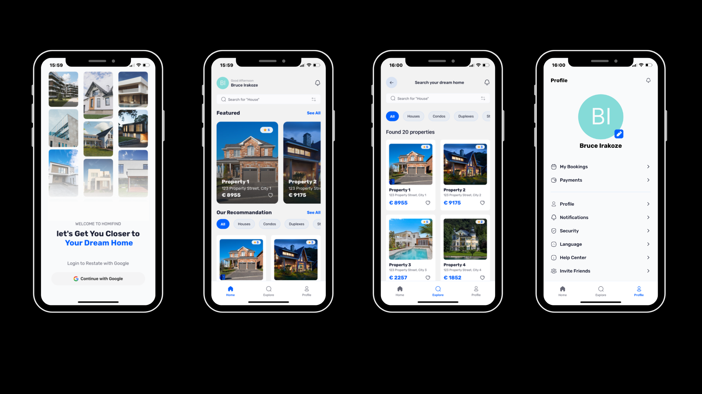

<div align="center">



  <div>
    
    
    
    
  </div>

  <h3 align="center">A HomiFind App</h3>

</div>

## 📋 <a name="table">Table of Contents</a>

1. 🤖 [Introduction](#introduction)
2. ⚙️ [Tech Stack](#tech-stack)
3. 🔋 [Features](#features)

## <a name="introduction">🤖 Introduction</a>

Build a full-stack Real Estate application with React Native, featuring Google authentication, dynamic property listings, and user profiles. Designed with modern tools like Expo SDK 53, Appwrite, Tailwind CSS, and TypeScript for a seamless and scalable experience.

## <a name="tech-stack">⚙️ Tech Stack</a>

- Expo
- React Native
- TypeScript
- Nativewind
- Appwrite
- Tailwind CSS

## <a name="features">🔋 Features</a>

👉 **Authentication with Google**: Secure and seamless user sign-ins using Google’s authentication service.

👉 **Home Page**: Displays the latest and recommended properties with powerful search and filter functionality.

👉 **Explore Page**: Allows users to browse all types of properties with a clean and intuitive interface.

👉 **Property Details Page**: Provides comprehensive information about individual properties, including images and key details.

👉 **Profile Page**: Customizable user settings and profile management

👉 **Centralized Data Fetching**: Custom-built solution inspired by TanStack’s useQuery for efficient API calls.

and many more, including code architecture and reusability

## <a name="quick-start">🤸 Quick Start</a>

Follow these steps to set up the project locally on your machine.

**Prerequisites**

Make sure you have the following installed on your machine:

- [Git](https://git-scm.com/)
- [Node.js](https://nodejs.org/en)
- [npm](https://www.npmjs.com/) (Node Package Manager)

**Cloning the Repository**

```bash
git clone https://github.com/irabruce10/HomiFind.git
cd HomiFind
```

**Installation**

```bash
npm install
```

**Set Up Environment Variables**

Create a new file named `.env.local` in the root of your project and add the following content:

```env
EXPO_PUBLIC_APPWRITE_ENDPOINT=https://cloud.appwrite.io/v1
EXPO_PUBLIC_APPWRITE_PROJECT_ID=
EXPO_PUBLIC_APPWRITE_DATABASE_ID=
EXPO_PUBLIC_APPWRITE_GALLERIES_COLLECTION_ID=
EXPO_PUBLIC_APPWRITE_REVIEWS_COLLECTION_ID=
EXPO_PUBLIC_APPWRITE_AGENTS_COLLECTION_ID=
EXPO_PUBLIC_APPWRITE_PROPERTIES_COLLECTION_ID=
```

Replace the values with your actual Appwrite credentials. You can obtain these credentials by signing up & creating a new project on the [Appwrite website](https://appwrite.io/).

**Start the app**

```bash
 npx expo start
```

In the output, you'll find options to open the app in a

- [development build](https://docs.expo.dev/develop/development-builds/introduction/)
- [Android emulator](https://docs.expo.dev/workflow/android-studio-emulator/)
- [iOS simulator](https://docs.expo.dev/workflow/ios-simulator/)
- [Expo Go](https://expo.dev/go), a limited sandbox for trying out app development with Expo

You can start developing by editing the files inside the **app** directory. This project uses [file-based routing](https://docs.expo.dev/router/introduction).

# Welcome to your Expo app 👋

This is an [Expo](https://expo.dev) project created with [`create-expo-app`](https://www.npmjs.com/package/create-expo-app).

## Get started

1. Install dependencies

   ```bash
   npm install
   ```

2. Start the app

   ```bash
   npx expo start
   ```

In the output, you'll find options to open the app in a

- [development build](https://docs.expo.dev/develop/development-builds/introduction/)
- [Android emulator](https://docs.expo.dev/workflow/android-studio-emulator/)
- [iOS simulator](https://docs.expo.dev/workflow/ios-simulator/)
- [Expo Go](https://expo.dev/go), a limited sandbox for trying out app development with Expo

You can start developing by editing the files inside the **app** directory. This project uses [file-based routing](https://docs.expo.dev/router/introduction).

## Get a fresh project

When you're ready, run:

```bash
npm run reset-project
```

This command will move the starter code to the **app-example** directory and create a blank **app** directory where you can start developing.

## Learn more

To learn more about developing your project with Expo, look at the following resources:

- [Expo documentation](https://docs.expo.dev/): Learn fundamentals, or go into advanced topics with our [guides](https://docs.expo.dev/guides).
- [Learn Expo tutorial](https://docs.expo.dev/tutorial/introduction/): Follow a step-by-step tutorial where you'll create a project that runs on Android, iOS, and the web.

## Join the community

Join our community of developers creating universal apps.

- [Expo on GitHub](https://github.com/expo/expo): View our open source platform and contribute.
- [Discord community](https://chat.expo.dev): Chat with Expo users and ask questions.
